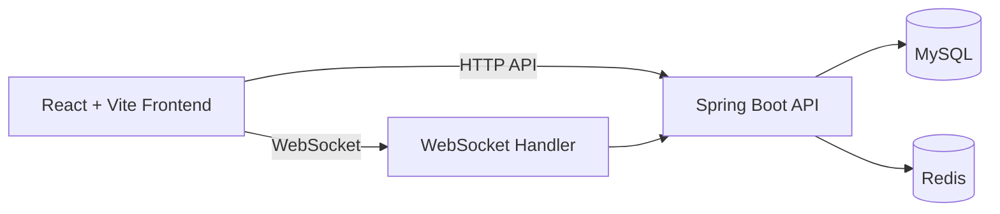
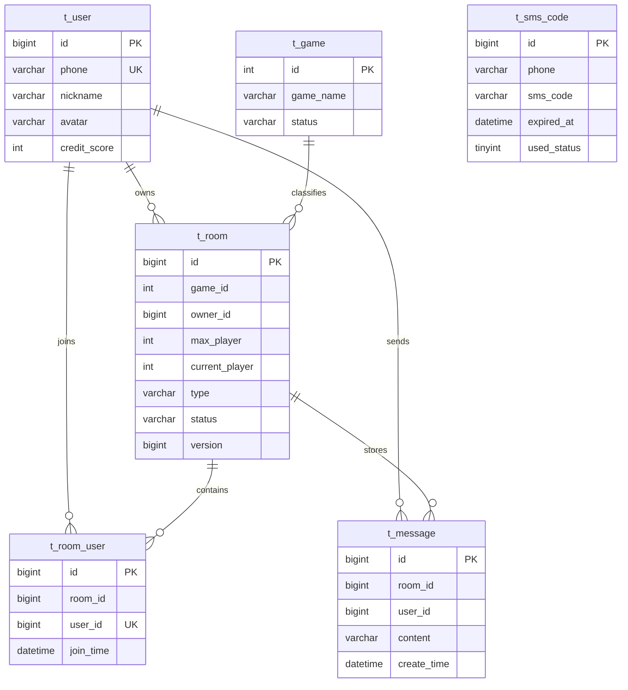
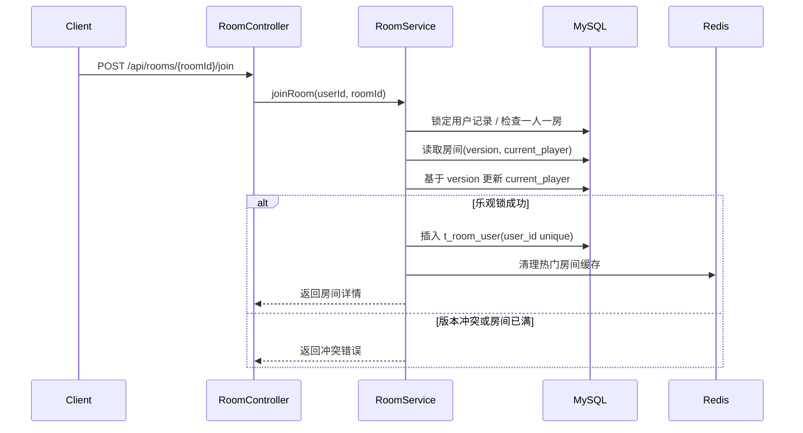

# GamingBar

GamingBar 是一个面向组队开黑场景的前后端分离项目，当前版本完成了以下核心升级：

- 数据库从 H2 运行时切换为 MySQL
- Redis 用于验证码缓存、限流、JWT 黑名单、在线人数和热门房间缓存
- 房间加入流程增加事务控制、数据库唯一约束和乐观锁
- 聊天室升级为 WebSocket 实时通信
- 提供 Docker Compose 一键启动 MySQL、Redis、Backend
- 补充并发测试、性能分析脚本和更完整的工程文档

## 技术栈

### Backend

- Java 17
- Spring Boot 3
- MyBatis
- Flyway
- MySQL 8
- Redis 7
- Spring WebSocket
- JUnit 5 + MockMvc

### Frontend

- React 18
- TypeScript
- Vite
- React Router
- Axios
- Native WebSocket

## 系统架构图



## 表结构图



## 核心流程时序图

以下是“加入房间”的关键并发控制流程：



## 目录结构

```text
Gaming-Bar/
├─ backend/
│  ├─ Dockerfile
│  ├─ pom.xml
│  ├─ docs/
│  │  ├─ explain.sql
│  │  └─ performance-notes.md
│  └─ src/
├─ front/
│  ├─ package.json
│  └─ src/
├─ docker-compose.yml
├─ .env.example
└─ README.md
```

## 快速开始

### 方式一：Docker Compose

在项目根目录执行：

```bash
docker-compose up --build
```

启动后默认服务：

- Backend: `http://localhost:8080`
- MySQL: `localhost:3306`
- Redis: `localhost:6379`

### 方式二：本地开发

#### 1. 启动 MySQL 和 Redis

推荐直接使用 `docker-compose up mysql redis -d`。

#### 2. 启动后端

```powershell
cd D:\Gaming-Bar\backend
mvn spring-boot:run
```

后端默认读取的关键环境变量见根目录 `.env.example`。

#### 3. 启动前端

```powershell
cd D:\Gaming-Bar\front
npm install
npm run dev
```

默认前端地址：

- `http://localhost:5173`

## 关键优化说明

### 1. 数据库升级

- 运行时数据源改为 MySQL
- Flyway 新增 `V3__mysql_upgrade_and_room_optimization.sql`
- 新增 `t_room.version` 字段用于乐观锁
- 新增索引和唯一约束：
  - `t_room(game_id, status, create_time)`
  - `t_room(status)`
  - `t_message(room_id, create_time, id)`
  - `t_message(room_id, id)`
  - `t_room_user(user_id)` 唯一索引

### 2. 并发安全

- `joinRoom` 保持事务边界
- 数据库层唯一索引保证“一人一房”
- 房间人数更新基于 `version` 做乐观锁控制
- 100 线程并发加入测试已覆盖

### 3. WebSocket 实时聊天

- 连接流程：先调用 `/api/auth/ws-ticket?roomId=...` 获取短时票据，再连接 `/ws/rooms/{roomId}?ticket=...`
- 支持事件：
  - `connected`
  - `chat_message`
  - `member_online`
  - `member_offline`
  - `pong`
  - `room_closed`
  - `left_room`
  - `error`
- 消息仍持久化到 MySQL
- 历史消息查询改为基于 `message_id` 的游标分页

### 4. Redis 职责

- 短信验证码缓存，TTL 5 分钟
- 发送短信接口限流
- 登录失败次数限制
- JWT 黑名单
- 房间在线人数缓存
- 热门房间缓存

### 5. 短信服务抽象

已拆分为：

- `SmsService`
- `MockSmsService`
- `RealSmsService`

当前默认启用 `MockSmsService`，控制台会打印验证码，方便联调和测试。

## 性能与索引设计

### 高频 SQL

- 房间大厅分页
- 我的房间分页
- 房间历史消息游标分页
- 热门房间查询

### EXPLAIN 分析

已提供脚本：

- `backend/docs/explain.sql`
- `backend/docs/performance-notes.md`

建议在 MySQL 启动后执行：

```sql
source backend/docs/explain.sql;
```

重点确认：

- 房间查询命中 `idx_room_game_status`
- 消息游标查询命中 `idx_message_room_id_id` 或 `idx_message_room_create_time`
- 一人一房约束命中 `uk_room_user_one_room`

## 并发问题说明

旧实现的风险点：

- 房间人数检查与加入不是基于版本控制
- 高并发时可能出现“最后一个名额被重复抢占”的窗口
- 仅靠应用层判断无法彻底避免一人多房

当前方案：

- 先锁定用户，收敛同一用户的并发加入
- 再基于 `version` 更新房间人数
- 最后通过 `t_room_user(user_id)` 唯一索引兜底

## 测试

### 后端测试

```powershell
cd D:\Gaming-Bar\backend
mvn test
```

已覆盖：

- 登录、资料更新、游戏列表
- 房间创建、加入、离开、解散
- 聊天消息读写
- 过期房间清理
- 非成员访问限制
- 100 线程并发加入房间

### 前端构建

```powershell
cd D:\Gaming-Bar\front
npm run build
```

## 技术选型原因

- Spring Boot：业务分层明确，适合快速搭建 API 和 WebSocket 服务
- MySQL：支持真实部署场景下的索引优化、事务和并发控制
- Redis：适合高频短 TTL 数据、限流和会话黑名单
- WebSocket：聊天室和在线状态天然适合服务端主动推送
- Flyway：数据库结构演进可追踪、可回滚、便于协作
- Docker Compose：本地环境可复制，降低联调成本

## 可扩展设计说明

- `SmsService` 已预留第三方短信供应商接入点
- `RoomRealtimeService` 独立封装实时事件分发逻辑
- `CacheService` 支持 `redis` 与 `in-memory` 两种实现，测试无需依赖外部 Redis
- JWT 黑名单与在线人数缓存已与业务层解耦，便于后续替换为集群方案
- 热门房间缓存和消息游标分页可继续扩展到更复杂的推荐与归档系统

## 安全说明

- JWT 鉴权 + Redis 黑名单
- 短信接口限流
- 登录失败限制
- WebSocket 握手校验短时票据、会话版本与房间成员身份
- DTO 接入 JSR-380 校验

当前仍建议继续增强：

- 多实例场景下通过 Redis Pub/Sub 或共享会话注册表同步 WebSocket 踢线
- 为生产环境替换默认示例密钥并收敛允许的 Origin
- 在可信反向代理前启用 `app.security.trust-forwarded-client-ip=true`

## 简历关键词

这个版本已经可以覆盖以下关键词：

- Spring Boot
- MySQL + 索引优化
- Redis 缓存 + 限流
- WebSocket 实时通信
- 乐观锁 + 事务控制
- Docker Compose
- 并发测试与性能优化
